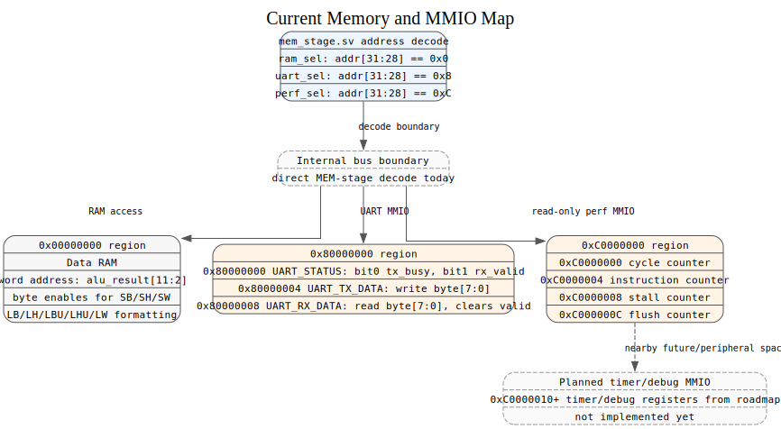

# Memory Map

## Memory and MMIO Map

| Address Range / Address | Function | Current Status |
|-------------------------|----------|----------------|
| `0x00000000` region | data memory | implemented through `data_mem.sv`, selected when address high nibble is `0x0` |
| `0x80000000` | UART status | implemented: bit 0 is TX busy, bit 1 is RX data valid |
| `0x80000004` | UART TX data | implemented: write byte 7:0 to transmit |
| `0x80000008` | UART RX data | implemented: read byte 7:0 and clear RX valid |
| `0xC0000000` | cycle counter | implemented as read-only performance-counter MMIO |
| `0xC0000004` | instruction counter | implemented as read-only performance-counter MMIO |
| `0xC0000008` | stall counter | implemented as read-only performance-counter MMIO |
| `0xC000000C` | flush counter | implemented as read-only performance-counter MMIO |
| `0xC0000010` | current PC | implemented as debug MMIO |
| `0xC0000014` | last committed PC | implemented as debug MMIO |
| `0xC0000018` | last committed instruction | implemented as debug MMIO |
| `0xC000001C` | last writeback data | implemented as debug MMIO |
| `0xC0000020` | last writeback status | implemented as debug MMIO; packs register index and reg-write flag |
| `0xC0000024` | faulting PC | implemented as debug MMIO |
| `0xC0000028` | faulting instruction | implemented as debug MMIO |
| `0xC000002C` | pipeline/debug status | implemented as debug MMIO; packs halt, illegal, stall, flush, PC-select, and trace metadata |
| `0xC0000030` | trace head/count | implemented as debug MMIO |
| `0xC0000040-0xC000007F` | 4-entry commit trace buffer | implemented as debug MMIO; each entry stores PC, instruction, writeback data, and a packed status word |
| `0xC0000200` | timer mtime (free-running counter) | implemented as read/write timer MMIO |
| `0xC0000204` | timer mtimecmp (compare value) | implemented as read/write timer MMIO |
| `0xC0000208` | timer control/status (bit 0 = enable, bit 1 = pending) | implemented as read/write timer MMIO |

## Internal Peripheral Bus

As of Phase 11, `mem_stage` routes every peripheral (RAM, UART, Timer,
Performance Counters, Debug MMIO) through an internal signal-bundle bus
rather than ad-hoc per-peripheral wiring. Each peripheral has its own
`bus_<periph>_addr` / `bus_<periph>_wdata` / `bus_<periph>_rdata` /
`bus_<periph>_byte_en` / `bus_<periph>_re` / `bus_<periph>_we` /
`bus_<periph>_ready` / `bus_<periph>_valid` signal group. The final
read-data mux selects among peripherals by valid signal, in the same
priority order used before the refactor (timer, debug, UART, performance
counters, RAM). This is an internal RTL refactor only — it does not
change any address in the table above. See `tb_memory_map.sv` for the
regression test covering this bus.