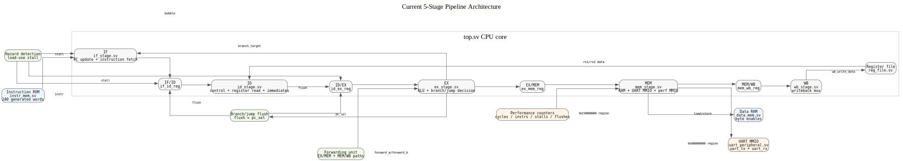
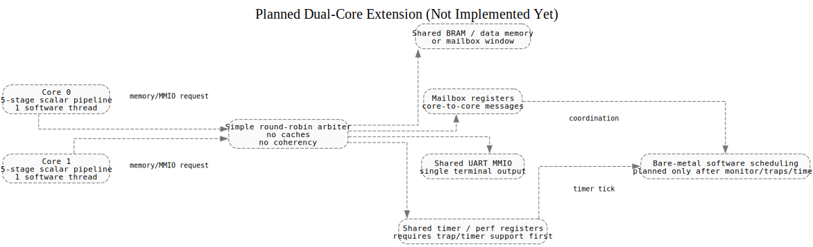
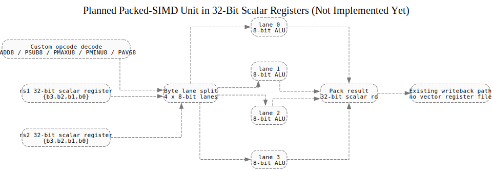

# Architecture

Last updated: 2026-06-22

<!-- This file is manually maintained. Last updated: 2026-06-22 -->

---

## Current Architecture Summary

The implemented system is a small bare-metal RISC-V soft SoC centered on a 5-stage RV32I pipelined processor. The current verified architecture includes: a ROM-preloaded instruction memory with a UART monitor-driven loader, data RAM, UART MMIO, performance-counter MMIO, debug MMIO, a 4-entry commit trace buffer, forwarding, load-use stall handling, branch/jump flushing, subword memory operations, FENCE/FENCE.I as NOP, ECALL/EBREAK/illegal instruction trapping with MRET, M-mode CSRs, timer interrupts, a 64-entry BHT dynamic branch predictor, and a custom packed-SIMD extension (PADD8/PSUB8/PMAXU8/PMINU8/PAVG8) on custom-0 opcode.

The UART monitor (`uart_monitor.sv`) provides 7 interactive commands over a serial terminal and controls CPU reset and UART passthrough. Debug read ports in `reg_file.sv`, `data_mem.sv`, `id_stage.sv`, `mem_stage.sv`, and `top.sv` let the monitor inspect register file, data memory, performance counters, and trace buffer state without going through MMIO.

---

## Top-Level Structure

| Item | Current Project State |
|------|-----------------------|
| Board wrapper | `fpga_top.sv` |
| CPU top | `top.sv` |
| Target board | PYNQ-Z2 / Zynq-7000 project files |
| CPU clocking | 125 MHz board clock through `PLLE2_BASE` to a 25 MHz CPU clock |
| Reset | board reset plus PLL lock synchronization into the CPU clock domain |
| External I/O | UART RX/TX, four status LEDs, halt output |
| Bitstream | Generated |

---

## Datapath

| Area | Status | Evidence |
|------|--------|----------|
| Board wrapper | Yes | `fpga_top.sv` wraps the CPU for PYNQ-Z2, including reset, LEDs, PLL, and UART pins |
| CPU core | Yes | `top.sv` instantiates the 5-stage pipeline and shared control blocks |
| 5-stage pipeline | Yes | IF, ID, EX, MEM, and WB stage modules are present |
| Pipeline registers | Yes | IF/ID, ID/EX, EX/MEM, and MEM/WB registers are present |
| Forwarding | Yes | `forwarding_unit.sv` is present and wired through EX |
| Load-use stall detection | Yes | `hazard_detection_unit.sv` is present and wired in `top.sv` |
| Branch/jump flushing | Yes | `top.sv` derives `flush` from `pc_sel`; current architecture remains flush-on-taken |
| Loadable instruction memory | Yes | `instr_mem.sv` includes `program_rom_init.svh` and exposes a write port for future loader support |
| Assembly/program flow | Yes | `asm/demo_perf_uart.s` and `program.mem` detected with 240 memory words |
| Subword load/store | Yes | `LB`, `LH`, `LBU`, `LHU`, `SB`, `SH`, and RAM byte enables detected |
| UART MMIO | Yes | `uart_peripheral.sv`, `uart_tx.sv`, and `uart_rx.sv` are present |
| Performance counters | Yes | cycle, instruction, stall, and flush counters are detected |
| PYNQ-Z2 UART constraints | Yes | `pynq_z2.xdc` constrains `uart_txd` and `uart_rxd` |
| `FENCE` / `FENCE.I` | Yes | Decoded as NOP via `OPCODE_MISC_MEM` (`7'b0001111`) in `control_unit.sv` |
| `ECALL` / `EBREAK` | Yes | Decoded via `OPCODE_SYSTEM` (`7'b1110011`) in `control_unit.sv`; latches halt signal to freeze pipeline |
| Illegal instruction detection | Yes | Unknown opcodes flag `illegal_instr` in `control_unit.sv`; triggers halt same as ECALL/EBREAK |

---

## Pipeline Organization

| Stage | Main Responsibility | Current Notes |
|-------|---------------------|---------------|
| IF | Fetch instruction and update PC | Instruction memory is ROM-preloaded and now exposes a write-port hook for future loader support; PC frozen on halt |
| ID | Decode instruction, read registers, generate immediates and controls | Full RV32I decode including ECALL/EBREAK/FENCE and illegal instruction detection |
| EX | ALU work, branch/jump target and decision, operand forwarding use | Forwarding supports EX/MEM and MEM/WB paths |
| MEM | RAM, UART MMIO, performance counter MMIO, load/store formatting | Byte and halfword operations are implemented with byte enables and sign/zero extension |
| WB | Select ALU or memory data and write register file | Writeback debug signals exposed at the CPU top |

---

## Memory and MMIO Map

See [memory-map.md](memory-map.md) for the full address map.

---

## Architecture Diagrams

The `.dot` files are generated text source diagrams. Render them to SVG or PNG with Graphviz when a visual artifact is needed.

| File | Purpose | Status |
|------|---------|--------|
| `diagrams/pipeline.dot` | Current pipeline datapath | Implemented architecture |
| `diagrams/memory_map.dot` | Current memory and MMIO decode | Implemented architecture with dashed future expansion notes |
| `diagrams/simd_unit.dot` | Packed-SIMD unit | Planned architecture, not implemented yet |
| `diagrams/multicore.dot` | Dual-core shared-memory architecture | Planned architecture, not implemented yet |

---

## Module Inventory

| File | Module(s) | Architecture Role |
|------|-----------|-------------------|
| `alu.sv` | `alu` | ALU datapath |
| `alu_control.sv` | `alu_control` | ALU control decode |
| `bht.sv` | `bht` | 64-entry Branch History Table dynamic predictor |
| `csr_file.sv` | `csr_file` | M-mode CSRs (mstatus, mtvec, mepc, mcause) |
| `timer.sv` | `timer` | Memory-mapped timer peripheral with interrupt generation |
| `control_unit.sv` | `control_unit` | Main RV32I control decode with halt and illegal instruction detection |
| `data_mem.sv` | `data_mem` | Word-addressed data RAM with byte write enables |
| `ex_stage.sv` | `ex_stage` | ALU, branch/jump decision, forwarding selection use |
| `forwarding_unit.sv` | `forwarding_unit` | EX/MEM and MEM/WB forwarding control |
| `fpga_top.sv` | `fpga_top` | PYNQ-Z2 wrapper, PLL clocking, reset synchronization, LEDs, UART pins |
| `hazard_detection_unit.sv` | `hazard_detection_unit` | Load-use stall detection |
| `id_stage.sv` | `id_stage` | Decode, register read, immediate/control generation with halt/illegal passthrough |
| `if_stage.sv` | `if_stage` | Instruction fetch and PC update |
| `imm_gen.sv` | `imm_gen` | Immediate generation |
| `instr_mem.sv` | `instr_mem` | Preloaded instruction memory with loader write-port foundation |
| `mem_stage.sv` | `mem_stage` | Data memory, UART MMIO, performance-counter MMIO, debug MMIO, commit trace buffer, subword access formatting |
| `pipeline_registers.sv` | `if_id_reg`, `id_ex_reg`, `ex_mem_reg`, `mem_wb_reg` | IF/ID, ID/EX, EX/MEM, MEM/WB registers with stall/flush/valid handling |
| `reg_file.sv` | `reg_file` | Integer register file |
| `top.sv` | `top` | CPU top level, stage wiring, hazard/forwarding wiring, performance counters, halt logic |
| `uart_monitor.sv` | `uart_monitor` | UART command-line monitor and program loader |
| `uart_peripheral.sv` | `uart_peripheral` | UART MMIO register block |
| `uart_rx.sv` | `uart_rx` | UART receiver |
| `uart_tx.sv` | `uart_tx` | UART transmitter |
| `wb_stage.sv` | `wb_stage` | Write-back result mux |

---

## Implemented Proof Points

| Check | Result |
|-------|--------|
| Simulation | PASS: `*** ALL TESTS PASSED (pipeline + perf counters + UART) ***` |
| Debug MMIO tests | PASS: current PC, last commit, fault, and trace buffer reads validated in simulation |
| Subword HDL | PASS: subword load/store decode and byte enables detected |
| Subword testbench coverage | PASS: subword operation names detected in `tb_top.sv` |
| Timing | PASS: WNS +5.265 ns, all user timing constraints met (2025.2 build) |
| Utilization | 7,127 LUTs / / 53200 (13.4%), 1737 registers / 106400 (1.63%), 1 BRAM / 140 (0.71%), 0 DSPs / 220 (0.00%) |

---

## Misaligned Access Policy

The current implementation **does not support misaligned** loads or stores. The behavior is:

| Operation | Alignment Requirement | Misaligned Behavior |
|-----------|----------------------|---------------------|
| `LW` | 4-byte aligned (addr[1:0] == 2'b00) | Address silently truncated to aligned; wrong data returned |
| `LH` / `LHU` | 2-byte aligned (addr[0] == 1'b0) | Address silently truncated to aligned; wrong data returned |
| `LB` / `LBU` | Always aligned (byte) | N/A -- byte access is always aligned |
| `SW` | 4-byte aligned (addr[1:0] == 2'b00) | Address silently truncated to aligned; wrong lanes written |
| `SH` | 2-byte aligned (addr[0] == 1'b0) | Address silently truncated to aligned; wrong lanes written |
| `SB` | Always aligned (byte) | N/A -- byte access is always aligned |

Full exception-on-misaligned requires trap CSR infrastructure (Phase 5). In the meantime, all software must use naturally-aligned addresses for halfword and word accesses.

---

## RV32I Instruction Support Table

### Fully Implemented and Tested

| Instruction | Format | Status | Notes |
|-------------|--------|--------|-------|
| `ADD` | R | Implemented | funct7=0x00 |
| `SUB` | R | Implemented | funct7=0x20 |
| `AND` | R | Implemented | |
| `OR` | R | Implemented | |
| `XOR` | R | Implemented | |
| `SLL` | R | Implemented | |
| `SRL` | R | Implemented | |
| `SRA` | R | Implemented | funct7=0x20 |
| `SLT` | R | Implemented | |
| `SLTU` | R | Implemented | |
| `ADDI` | I | Implemented | |
| `ANDI` | I | Implemented | |
| `ORI` | I | Implemented | |
| `XORI` | I | Implemented | |
| `SLLI` | I | Implemented | |
| `SRLI` | I | Implemented | |
| `SRAI` | I | Implemented | funct7=0x20 |
| `SLTI` | I | Implemented | |
| `SLTIU` | I | Implemented | |
| `LW` | I | Implemented | 4-byte aligned only |
| `LH` | I | Implemented | 2-byte aligned only |
| `LHU` | I | Implemented | 2-byte aligned only |
| `LB` | I | Implemented | |
| `LBU` | I | Implemented | |
| `SW` | S | Implemented | 4-byte aligned only |
| `SH` | S | Implemented | 2-byte aligned only |
| `SB` | S | Implemented | |
| `BEQ` | B | Implemented | |
| `BNE` | B | Implemented | |
| `BLT` | B | Implemented | |
| `BGE` | B | Implemented | |
| `BLTU` | B | Implemented | |
| `BGEU` | B | Implemented | |
| `JAL` | J | Implemented | |
| `JALR` | I | Implemented | |
| `LUI` | U | Implemented | |
| `AUIPC` | U | Implemented | |
| `FENCE` | I | Implemented | Decoded as NOP |
| `FENCE.I` | I | Implemented | Decoded as NOP |
| `ECALL` | I | Implemented | Halts the pipeline |
| `EBREAK` | I | Implemented | Halts the pipeline |
| `MUL` | R | Implemented | RV32M Extension |
| `MULH` | R | Implemented | RV32M Extension |
| `MULHSU` | R | Implemented | RV32M Extension |
| `MULHU` | R | Implemented | RV32M Extension |

### Packed-SIMD Extension (custom-0 opcode 0001011)

| Instruction | Format | Status | Notes |
|-------------|--------|--------|-------|
| `PADD8` | R | Implemented | 4× 8-bit unsigned add, wrap |
| `PSUB8` | R | Implemented | 4× 8-bit unsigned sub, wrap |
| `PMAXU8` | R | Implemented | 4× unsigned 8-bit max |
| `PMINU8` | R | Implemented | 4× unsigned 8-bit min |
| `PAVG8` | R | Implemented | 4× unsigned 8-bit avg, round down |

### Intentionally Unsupported

| Instruction | Reason |
|-------------|--------|
| `CSRRW`, `CSRRS`, `CSRRC`, `CSRRWI`, `CSRRSI`, `CSRRCI` | Implemented in Phase 5 |
| `MRET` | Implemented in Phase 5 |
| `WFI` | Not applicable to this bare-metal design |
| `DIV`, `DIVU`, `REM`, `REMU` | RV32M division not implemented yet |

---

## Not Yet Detected

| Architecture Item | Detection Status |
|-------------------|------------------|
| Misaligned load/store exception support | Not detected (documented policy above) |
| Dual-core / shared-memory variant | Not detected |

---

## Maintenance Rule

Do not manually mark architecture features as implemented unless the generator can prove them from source files or verification artifacts.
